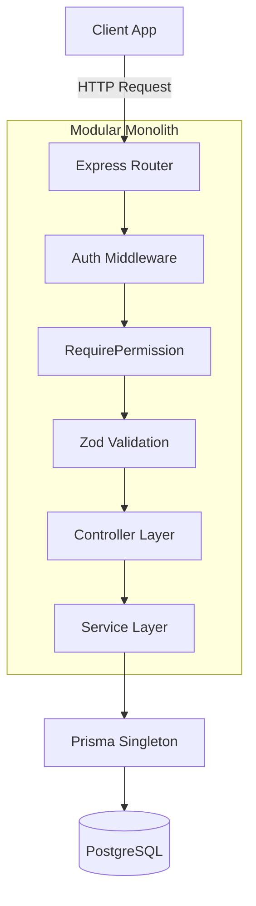

# Project Overview

ELIMINATE is an enterprise-grade Workforce Management Platform built to streamline operations across agencies, clients, and workers. 

At its core, the business problem ELIMINATE solves is the complex orchestration of human capital. Managing shift workers, tracking language and skill proficiencies, assigning workers across multiple agencies, and fulfilling dynamic client job requirements are historically disjointed processes. ELIMINATE provides a centralized, single source of truth for these operations.

Our overall vision is to eliminate the friction in gig and contract workforce placement by providing a robust, highly modular API backend capable of securely bridging clients seeking talent with agencies providing vetted workers.

# Core Objectives

1. **Unify Workforce Data**: Centralize the tracking of worker skills, languages, and proficiencies into a strict relational database to enable precise matching.
2. **B2B Integration**: Provide seamless tools for Client and Agency onboarding, ensuring strict logical boundaries through Role-Based Access Control (RBAC).
3. **Data Integrity & Security**: Guarantee that no relational orphans occur and that complex Many-to-Many mappings (e.g., Agency-Worker, Worker-Skill) are strictly enforced and securely accessed.
4. **Scalable Monolith Design**: Maintain a modular structure that keeps deployment simple while allowing for massive horizontal feature expansion.

# Key Features

The ELIMINATE backend is partitioned into independent but inter-communicating modules:

- **Authentication**: JWT-based session handling, secure password hashing, and refresh token rotation.
- **Worker Management**: Core profiling for laborers/gig workers, tracking their employment status and basic demographics.
- **Client Management**: B2B profiles for entities creating job requirements.
- **Agency Management**: B2B profiles for organizations that manage and supply workers.
- **Skills**: Global dictionary of assignable skills.
- **Categories**: Taxonomies used to classify Job Requirements.
- **Languages**: Global dictionary of spoken and written languages.
- **Locations**: Global dictionary of geographical work sites or districts.
- **Worker Skills**: Relational mapping storing proficiency levels and primary skill indicators.
- **Worker Languages**: Relational mapping tracking native vs. conversational proficiency.
- **Agency Workers**: Relational mapping managing assignments of workers to specific agencies.
- **Job Requirements**: Complex documents specifying client needs (workers needed, timeframe, salary, location, priority).

# High-Level Architecture

The architecture utilizes a strict Modular Monolith approach. Every business domain is physically separated into its own folder containing exactly 4 layers (Validation, Service, Controller, Routes), communicating with a shared Prisma Database Singleton.



# Technology Stack

| Technology | Purpose | Rationale |
|------------|---------|-----------|
| **React** | Frontend Framework | Declarative component model allows for rapid UI development. |
| **Vite** | Frontend Build Tool | Significantly faster HMR and build times compared to Webpack/CRA. |
| **Tailwind CSS** | Styling | Utility-first CSS provides consistency and eliminates dead CSS. |
| **Express.js** | Backend Framework | Lightweight, unopinionated routing engine perfectly suited for a modular monolith. |
| **JavaScript (ES Modules)** | Backend Language | Native ESM provides cleaner syntax and aligns backend with modern JS standards. |
| **Prisma ORM** | Database Toolkit | Type-safe query builder that handles migrations, cascading, and relational mapping effortlessly. |
| **PostgreSQL** | Relational Database | ACID compliant, highly scalable, and handles massive relational joins with ease. |

# Design Principles

> [!TIP]
> The guiding philosophy behind ELIMINATE is absolute modularity without the deployment overhead of microservices.

- **Modular Monolith**: Features are grouped by domain (e.g., `workers/`, `auth/`), not by layer (e.g., no global `controllers/` folder). This ensures that deleting a feature is as simple as deleting one folder.
- **Thin Controllers**: Controllers contain **zero** business logic. Their sole job is unwrapping the HTTP request (`req.validatedData`) and formatting the HTTP response via `ApiResponse`.
- **Service Layer**: The beating heart of the application. All Prisma database queries, transaction bundling, and custom `AppError` throws occur strictly here.
- **Validation Layer**: We utilize Zod `.strict()` schemas globally. If a client sends an unknown field in a payload, the request is instantly rejected before it ever reaches the controller.
- **RBAC (Role-Based Access Control)**: Every route is locked behind a strict `requirePermission('module:action')` slug.
- **Soft Delete**: Hard deletions (`DELETE FROM`) are strictly forbidden. All models utilize a `deletedAt` DateTime flag, preserving historical audits and relational integrity.
- **Prisma Singleton**: Database connections are routed through a single exported Prisma client instance to prevent connection pooling exhaustion during high traffic.

# Project Structure Summary

```text
apps/backend/
├── prisma/               # Database schema and migrations
├── src/
│   ├── config/           # Environment variables and Singletons
│   ├── middleware/       # Express global intercepts (Auth, Error, Zod)
│   ├── modules/          # Core Business Domains (The Monolith)
│   ├── shared/           # Global helpers (AppError, ApiResponse)
│   ├── routes/           # Central API Index
│   └── server.js         # Entry Point
```

# Development Standards

- **Strict Mode Formatting**: Code formatting and linting are rigorously enforced.
- **Never Trap DB Errors**: Services manually check for existence (e.g., "Worker not found") and throw `AppError` rather than allowing Prisma to crash with generic foreign-key violations.
- **ApiResponse**: Every successful request must be returned using the `ApiResponse.success(res, msg, data)` wrapper to guarantee frontend consistency.
- **Asynchronous Wrappers**: Never use `try/catch` in controllers. Wrap all controllers in `asyncHandler`.

# Module Overview

| Module | Purpose | Status |
|--------|---------|--------|
| **Auth** | Session and token management | ✅ Implemented |
| **Workers** | Core gig worker profiling | ✅ Implemented |
| **Clients** | B2B job creators | ✅ Implemented |
| **Agencies** | B2B workforce suppliers | ✅ Implemented |
| **Skills** | Global taxonomy for abilities | ✅ Implemented |
| **Categories** | Global taxonomy for job sectors | ✅ Implemented |
| **Languages** | Global taxonomy for communication | ✅ Implemented |
| **Locations** | Global taxonomy for geography | ✅ Implemented |
| **Worker Skills** | Relational mapping for worker abilities | ✅ Implemented |
| **Worker Languages**| Relational mapping for worker tongues | ✅ Implemented |
| **Agency Workers** | Relational mapping for agency supply | ✅ Implemented |
| **Job Requirements**| Core job specification documents | ✅ Implemented |

# Current Implementation Status

ELIMINATE is currently in the **Foundational Phase**. The core B2B (Clients, Agencies) and B2C (Workers) profiles have been fully implemented alongside all critical global dictionaries (Skills, Locations, Languages). 

The fundamental many-to-many relationship mappings connecting workers to their respective skills, languages, and agencies are production-ready. The system is now fully capable of creating and validating complex `JobRequirement` documents.

# Future Roadmap

As the foundation is now solid, ELIMINATE will soon expand into its operational phase. The upcoming modules are:

- **Booking**: Reserving specific workers for job requirements.
- **Assignment**: Dispatching workers to live work sites.
- **Attendance**: Tracking daily check-ins and hours worked.
- **Payment**: Tracking outgoing payroll to workers/agencies.
- **Invoice**: Billing clients for fulfilled requirements.
- **Notification**: Alerting users via email/SMS.
- **Reports**: Generating analytical dashboards.
- **Platform Settings**: Managing global system configurations.

# Getting Started

If you are a new developer onboarding to ELIMINATE, we recommend reading the documentation in the following order:

1. Read **[Architecture](./01-architecture.md)** to understand the flow of data.
2. Read **[Folder Structure](./02-folder-structure.md)** to navigate the codebase.
3. Review **[Database Schema](./database/schema.md)** to understand relationships.
4. Dive into the individual module documentation in the `docs/` folder (start with **Auth** and **Workers**).
