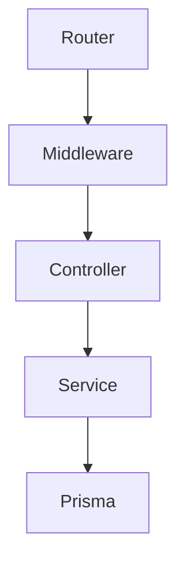
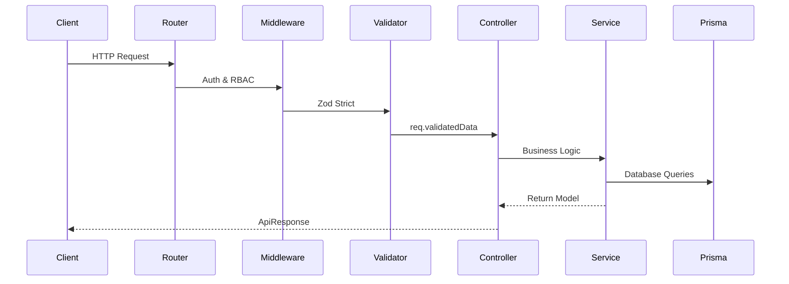

# ELIMINATE: System Architecture

## Overall System Architecture
ELIMINATE uses a Modular Monolith backend powered by Express.js, PostgreSQL, and Prisma ORM.

## Layered Architecture

The Repository Pattern is explicitly banned. Services query Prisma directly.

## Request Lifecycle

## Prisma Flow
Prisma is a singleton to prevent connection leaks.

## Error Handling
Throw `AppError(msg, status)` in Services. `asyncHandler` catches it for the global error middleware.

## Configuration
Secrets are extracted and validated in `src/config/`. Never read `process.env` in a Service.
