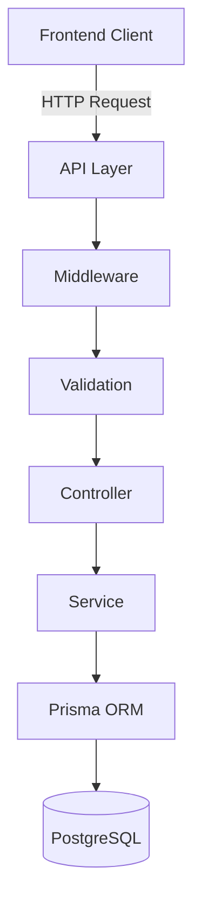
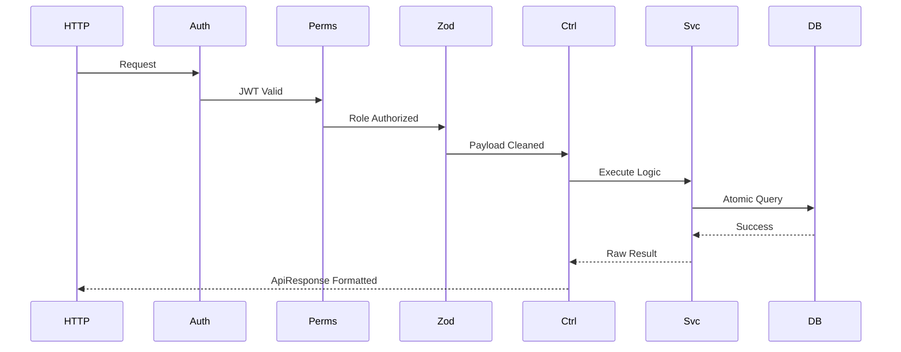
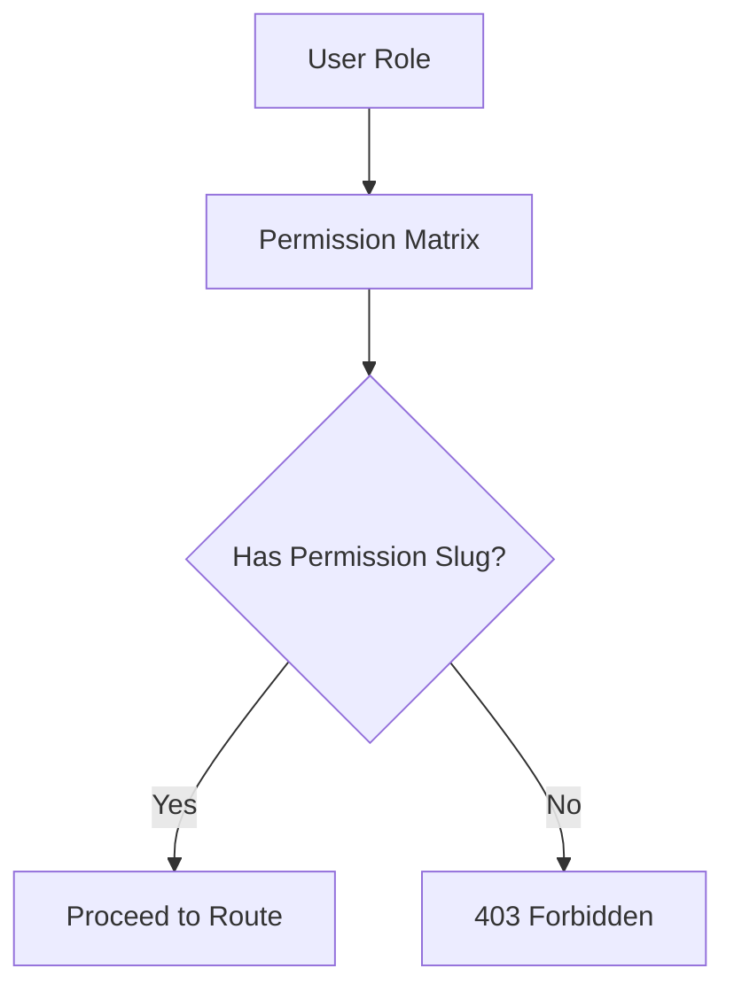

# Architecture Overview

The ELIMINATE backend architecture is founded on strict separation of concerns, explicit domain boundaries, and uncompromising data integrity. 

A Modular Monolith architecture was selected to reap the benefits of microservices (domain isolation, independent scaling potential, and bounded contexts) without inheriting their devastating operational complexities (distributed transactions, network latency, multi-repository hell). By keeping all modules within a single deployment and a single Prisma Singleton, we maintain absolute referential integrity across our relational PostgreSQL database while keeping code boundaries surgically clean.

# System Architecture

# Backend Layer Responsibilities

| Layer | Responsibility | Example Files |
|-------|----------------|---------------|
| **Middleware** | Intercepts HTTP traffic, verifies JWT integrity, enforces Role-Based Access Control, and intercepts global errors. | `auth.middleware.js`, `error.middleware.js` |
| **Validation** | Implements Zod schemas to aggressively sanitize payloads, strip unknown fields, and enforce type safety before execution. | `worker.validation.js` |
| **Controller** | Acts as a thin transport boundary. Unwraps Express constructs (`req`, `res`), calls the Service layer, and formats output into `ApiResponse`. | `client.controller.js` |
| **Service** | The sole executor of business rules. Handles existential DB checks, Prisma transactions, duplicate prevention, and throws `AppError`. | `agency.service.js` |

# Request Lifecycle

Every inbound HTTP request must survive a strict, linear gauntlet before modifying data.

1. **HTTP Request**: Initiated by the client.
2. **Express**: Routes traffic to the specific module.
3. **Authentication Middleware**: Verifies JWT signature and expiry.
4. **Authorization Middleware**: Verifies user possesses the exact required Permission Slug.
5. **Validation**: Zod sanitizes the payload, stripping unknowns via `.strict()`, and maps it to `req.validatedData`.
6. **Controller**: Extracts `req.validatedData` and invokes the Service.
7. **Service**: Evaluates business logic, checking for duplicates or missing parent entities.
8. **Prisma**: Translates the logical request into optimized SQL.
9. **Database**: Executes the query.
10. **ApiResponse**: The payload is uniformly serialized and returned.

# Module Architecture

The Modular Monolith is partitioned into physically independent business domains:

- **Authentication**: Core JWT signing, refresh token rotation, and identity verification.
- **Worker**: Manages B2C gig worker profiles, demographics, and statuses.
- **Client**: Manages B2B profiles for entities purchasing workforce labor.
- **Agency**: Manages B2B profiles for organizations supplying workers.
- **Skill**: Global dictionary of standardized abilities.
- **Category**: Global taxonomy classifying job sectors.
- **Language**: Global dictionary of communication languages.
- **Location**: Geographical zones for work placement.
- **WorkerSkill**: Many-to-Many relational table linking Workers to Skills with proficiency metrics.
- **WorkerLanguage**: Many-to-Many relational table linking Workers to Languages.
- **AgencyWorker**: Many-to-Many relational table linking Workers to managing Agencies.
- **JobRequirement**: Complex operational documents defining labor needs, timeframe, and budget.

# Folder Philosophy

Every module encapsulates exactly four files to enforce architectural predictability:

- **routes.js**: Defines endpoints and links the middleware pipeline.
- **controller.js**: Isolates Express.js HTTP context from the domain logic.
- **service.js**: Isolates Prisma and business logic from the HTTP transport layer.
- **validation.js**: Defends the module from malicious or malformed I/O payloads.

This structure guarantees that removing or refactoring a domain requires modifying exactly one isolated directory.

# Service Layer

- **Responsibilities**: The service layer acts as the absolute authority on business logic. No other layer is permitted to access Prisma or make business decisions.
- **Business Rules**: Prevents duplicate insertions, verifies the existence of relational parents, and calculates dynamic operational states.
- **Database Access**: Exclusively executes Prisma queries. 
- **Transactions**: Employs Prisma `$transaction` API when executing operations requiring multi-table mutations to prevent fragmented data.
- **Error Handling**: Throws custom `AppError` exceptions (e.g., `404 Not Found`, `409 Conflict`), allowing the global error handler to safely intercept and serialize the failure.

# Controller Layer

- **Thin Controller Pattern**: Controllers are structurally lightweight, acting strictly as traffic coordinators.
- **Responsibilities**: Unwrapping `req.validatedData`, `req.params`, passing them to the Service, and formatting the response via `ApiResponse.success()`.
- **Prohibited Business Logic**: Controllers contain zero `if/else` business rules and zero Prisma queries. This ensures the Service layer remains pure and independently testable outside of the Express context.

# Validation Layer

- **Pre-execution Validation**: By validating data before the Controller, we guarantee the Service layer receives guaranteed type-safe, sanitized objects.
- **req.validatedData**: The Zod interceptor mutates the request object by injecting `req.validatedData`. Controllers pull from this payload exclusively, ignoring the untrustworthy `req.body` directly.

# Middleware Flow

# Authentication Architecture

- **JWT**: Stateless, short-lived JSON Web Tokens govern API access.
- **Access Token**: Contains the `userId`, `role`, and `profileType`, passed via headers or memory.
- **Refresh Token**: Hashed and securely stored in the DB, passed via `HttpOnly` cookies to silently mint new Access Tokens.
- **Authentication Middleware**: `auth.middleware.js` intercepts the request, decodes the JWT using 256-bit secrets, and attaches `req.user`.
- **Authorization Middleware**: `requirePermission` utilizes RBAC matrixes to evaluate if `req.user.role` permits the requested action.
- **RBAC**: Role-Based Access Control dictates hierarchical permissions mapping Actions to Routes.

# Authorization Flow

# Database Architecture

- **Prisma Singleton**: Defined in `config/prisma.js`, instantiates exactly one Prisma Client instance globally to aggressively prevent connection pooling limits on the PostgreSQL server.
- **Prisma Client**: Provides type-safe querying, completely eliminating raw SQL vulnerabilities.
- **Transactions**: Atomic operations wrap multiple insertions to guarantee logical consistency.
- **Soft Delete**: Hard deletions are globally prohibited. A `deletedAt` DateTime flag is injected. Services append `deletedAt: null` to bypass soft-deleted records.
- **UUID**: Universal Unique Identifiers secure primary keys against enumeration attacks.
- **Indexes**: Composite and singular `@@index` constraints optimize read-heavy filtering and sorting patterns.

# Error Handling

- **AppError**: A standardized class extending `Error`, injecting HTTP status codes and operational flags.
- **Global Error Middleware**: Intercepts unhandled promises and `AppError` throws, stripping system stack traces in production to prevent intelligence leakage.
- **ApiResponse**: `ApiResponse.error()` uniformizes all outbound failure responses.
- **HTTP Status Codes**: Strictly mapped to logical failures (400 Zod, 401 JWT, 403 RBAC, 404 Missing, 409 Conflict, 500 Fatal).

# Security Architecture

- **JWT**: Cryptographically prevents session spoofing.
- **Password Hashing**: `bcrypt` ensures passwords are mathematically protected against database breaches.
- **RBAC**: Mathematically ensures horizontal privilege escalation is impossible.
- **Validation**: Zod `.strict()` neutralizes Mass Assignment vulnerabilities by actively dropping undocumented payload keys.
- **Soft Delete**: Prevents catastrophic, unrecoverable data loss.
- **Secure API Design**: Insensitive identifiers (UUIDs) prevent sequential scraping of B2B or B2C data.

# Design Decisions

- **Modular Monolith**: Overcame the deployment complexity of microservices while retaining domain isolation.
- **No Repository Pattern**: Prisma's native methods (`findUnique`, `create`) already abstract the SQL dialect perfectly. Adding a repository layer would constitute redundant boilerplate.
- **Prisma Singleton**: Required to prevent Next.js/Express hot-reload connection exhaustions.
- **Service Layer**: Ensures HTTP mechanics (Express) never contaminate business logic.
- **Soft Delete**: Auditing and historic relationships must survive user deletion events to preserve analytical continuity.
- **RBAC**: Granular permission slugs (`worker:read`, `agency:delete`) scale infinitely better than hardcoded integer-based role levels.

# Scalability

Because domain logic is strictly boxed within modules (e.g., `src/modules/job-requirements`), expanding to 50+ modules requires zero architectural redesign. New developers simply copy the folder structure blueprint. Should traffic demand it, this exact codebase can be split into microservices by physically relocating the domain folders to separate repositories with near-zero refactoring of the internal service logic.

# Best Practices

- Always use `asyncHandler` wrapping controller functions; never write manual `try/catch` blocks unless handling highly specific external API fallbacks.
- Always use `req.validatedData`; never read from `req.body` inside a controller.
- Always throw `AppError` from the service; never throw raw strings or generic `Error` instances.
- Always check `deletedAt: null` in Prisma `findMany` and `findUnique` operations.
- Always utilize `onDelete: Cascade` in Prisma mapping tables to handle automatic cleanup of orphan relationships.
