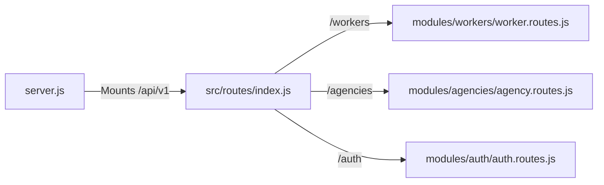
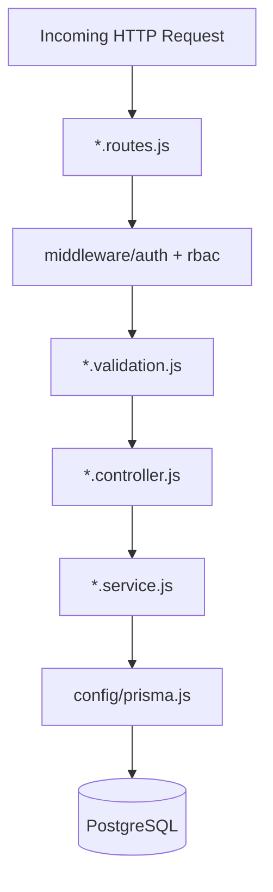

# Folder Structure Philosophy

The ELIMINATE backend is architected using a strict **Modular Monolith** pattern. 

We organize our project by **modules** (business domains) rather than by **technical layers** (e.g., placing all controllers in a global `controllers/` folder). This philosophy guarantees that each module is entirely **self-contained**. 

By grouping the routing, controller, service, and validation logic into a single folder per domain, we drastically improve maintainability. Developers no longer need to hunt across the entire codebase to understand a single feature. This structure guarantees infinite horizontal scalability—adding a new feature simply means creating a new, isolated folder without risking regression bugs in existing systems.

# Backend Folder Structure

```text
apps/backend/src/
├── config/
├── middleware/
├── shared/
└── modules/
    ├── agencies/
    ├── agency-worker/
    ├── auth/
    ├── categories/
    ├── clients/
    ├── job-requirements/
    ├── languages/
    ├── locations/
    ├── skills/
    ├── worker-language/
    ├── worker-skill/
    └── workers/
```

- **`config/`**: Contains global singleton instantiations and environment variable bindings.
- **`middleware/`**: Contains Express interceptors that run *before* route execution (Auth, RBAC, Validation).
- **`shared/`**: Contains universally applicable utilities, standardized error classes, and response formatters.
- **`modules/`**: The core of the monolith. Every business domain exists here as a physically isolated entity.

# Module Structure

Each module in this project adheres to a strict 4-file flat structure. 

```text
src/modules/workers/
├── worker.controller.js
├── worker.service.js
├── worker.validation.js
└── worker.routes.js
```

| File | Responsibility |
|------|----------------|
| `*.routes.js` | Express Router configuration. Binds endpoints, maps middleware (Auth, RBAC, Validate), and directs traffic to the Controller. |
| `*.controller.js` | The thin HTTP transport layer. Unwraps `req.validatedData` and formats the outgoing `ApiResponse`. Contains **zero** business logic. |
| `*.service.js` | The absolute authority on business logic. Executes Prisma queries, enforces database rules, and throws `AppError` on violations. |
| `*.validation.js` | Defends the module using Zod. Exposes `.strict()` schemas to strip malicious payloads before they ever reach the controller. |

# Shared Folder

The `shared/` directory is strictly reserved for code that applies across the *entire* application boundary, never specific to a single domain.

- **`ApiResponse.js`**: A standardized static class ensuring every successful JSON payload follows the exact same structure (`{ success, message, data, meta }`).
- **`AppError.js`**: An extended `Error` class utilized exclusively by the Service layer to attach HTTP status codes (e.g., 404, 409) to logical failures.
- **`asyncHandler.js`**: A higher-order wrapper function that automatically catches asynchronous Promise rejections, completely eliminating the need for `try/catch` blocks in controllers.
- **`constants/`, `helpers/`, `utilities/`**: Directories for cross-domain static values and helper functions (e.g., date formatters).

# Config Folder

- **Prisma Singleton**: `prisma.js` exports a single instance of the Prisma Client. This prevents connection exhaustion during local development (HMR) and production spikes.
- **Environment**: Centralized extraction and validation of `process.env` variables.
- **JWT**: Configuration for token signatures and lifecycles.
- **Application Config**: CORS, Port, and core Express application settings.

# Middleware Folder

- **`authenticate`**: Verifies the incoming JWT signature. If valid, attaches the decoded payload to `req.user`.
- **`requirePermission`**: The RBAC gatekeeper. Accepts a permission slug (e.g., `worker:create`) and rejects the request (`403 Forbidden`) if `req.user` lacks the authority.
- **`validate`**: Injects Zod schemas. On success, maps the sanitized object to `req.validatedData`. On failure, halts the request and returns a `400 Bad Request` map of the exact errors.
- **`errorHandler`**: The global safety net. Catches `AppError` and system crashes, serializing them into safe, sanitized JSON responses.

# Route Registration

Module routes are centrally registered in `src/routes/index.js`, acting as the master API manifest.



# Request Flow Through Folder Structure



# Naming Conventions

This project enforces strict `kebab-case` file naming matching the module's singular domain, suffixed with the layer type.

- `worker.service.js`
- `worker.controller.js`
- `worker.validation.js`
- `worker.routes.js`
- `agency-worker.service.js` (For multi-word modules)

# Import Rules

> [!WARNING]  
> Circular dependencies are fatal.

1. **Top-Down Only**: Routes import Controllers. Controllers import Services. Services import Prisma. Never in reverse.
2. **Cross-Module Boundaries**: If a module requires data from another module, it must query Prisma directly or call the sibling's exported Service function. Controllers must *never* call other Controllers.
3. **Paths**: Utilize relative paths strictly, keeping imports localized to the 4-file boundary as much as possible.

# Best Practices

- **One responsibility per file**: Never mix validation schemas into controller files.
- **No business logic in controllers**: If a controller contains an `if/else` statement evaluating domain rules, the architecture has failed.
- **No validation in services**: The service trusts that the payload is already mathematically perfect because the Zod middleware guaranteed it.
- **No database access outside services**: Only `.service.js` files may import `config/prisma.js`.
- **Shared utilities only inside `shared/`**: Never place a helper function inside a module if it's used globally.

# Future Module Guidelines

To add a new module (e.g., `Booking`), follow this exact sequence:

1. **Database**: Update `prisma/schema.prisma` with the new model and execute `prisma migrate dev`.
2. **Scaffold Directory**: Create `src/modules/bookings/`.
3. **Validation**: Create `booking.validation.js` and define `.strict()` Zod schemas.
4. **Service**: Create `booking.service.js` and implement existential checks and Prisma queries.
5. **Controller**: Create `booking.controller.js` using `asyncHandler` and `ApiResponse`.
6. **Routes**: Create `booking.routes.js`, apply the middleware chain (`authenticate`, `requirePermission`, `validate`), and map to the controller.
7. **Registration**: Mount the new route in `src/routes/index.js`.
