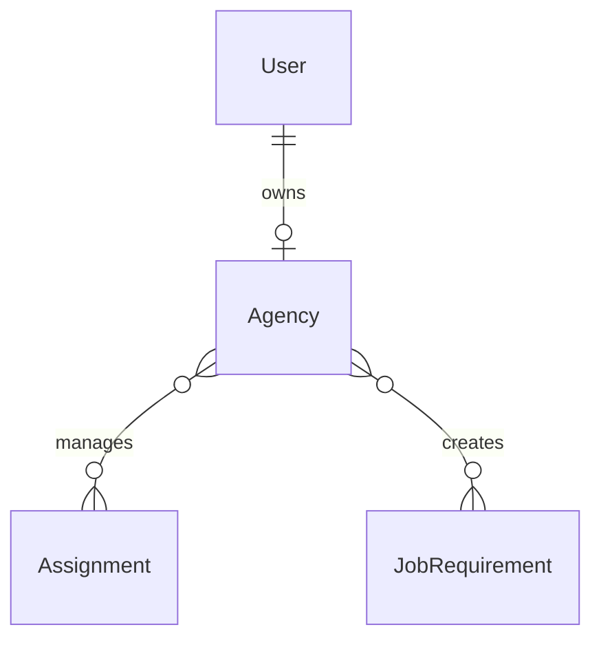

# Agency Database

## Security & Architecture
- **Isolation**: 1:1 mapped to `User` ensuring no authentication data leak.
- **Deduplication**: Soft checks exist at the service layer for `email` and `gstNumber`.
- **Primary Keys**: Exclusively UUID identifiers.
- **Tombstones**: Soft deleted via `deletedAt` DateTime flags instead of hard row destruction.
