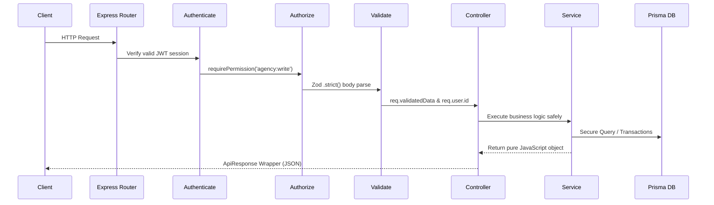

# Agency Execution Flow

```mermaid
sequenceDiagram
    Client->>Express Router: HTTP Request
    Express Router->>Authenticate: Verify valid JWT session
    Authenticate->>Authorize: requirePermission('agency:write')
    Authorize->>Validate: Zod .strict() body parse
    Validate->>Controller: req.validatedData & req.user.id
    Controller->>Service: Execute business logic safely
    Service->>Prisma DB: Secure Query / Transactions
    Service-->>Controller: Return pure JavaScript object
    Controller-->>Client: ApiResponse Wrapper (JSON)
```
