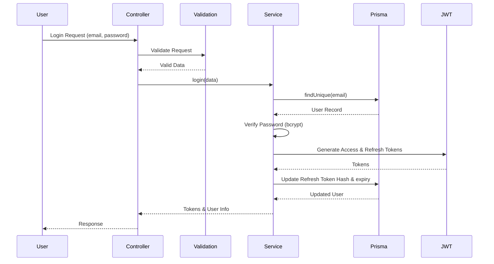
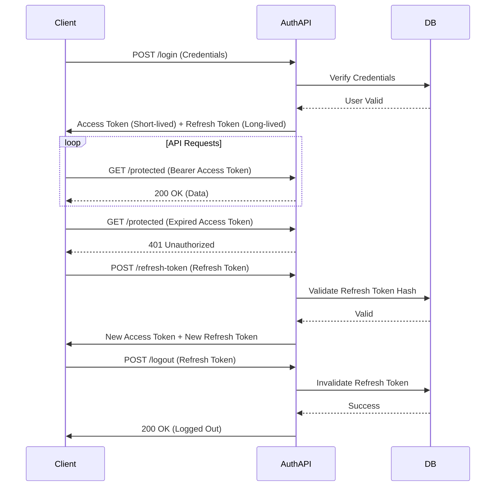

# Authentication Module Overview

The Authentication module provides secure user identification, session management, and access control for the ELIMINATE platform. It handles the complete lifecycle of user authentication, from initial registration to session termination.

Authentication is separated into its own module to ensure separation of concerns, improve maintainability, and provide a single source of truth for security policies. This modular approach allows the authentication logic to be reused and updated independently of the core business features.

## Responsibilities

This module is responsible for:
- **User Registration**: Creating new user accounts with specific roles (CLIENT, AGENCY, WORKER).
- **Login**: Authenticating users and issuing session tokens.
- **JWT**: Generating and validating JSON Web Tokens for API authorization.
- **Refresh Tokens**: Managing long-lived refresh tokens for session renewal.
- **Logout**: Terminating user sessions and invalidating refresh tokens.
- **Current User**: Retrieving the authenticated user's profile and state.
- **Password Management**: Handling password changes, forgot password workflows, and resets.
- **Email Verification**: Managing the email verification process.
- **Authorization**: Validating user state and permissions before allowing route access.

## Module Structure

```text
src/modules/auth/
├── auth.controller.js  # Handles incoming HTTP requests and responses
├── auth.service.js     # Contains core business logic and database interactions
├── auth.validation.js  # Defines Zod schemas for request validation
├── auth.routes.js      # Maps API endpoints to controller functions
└── auth.utils.js       # Utility functions for JWT generation and verification
```

## Authentication Flow



## Features

- **Registration**: Allows users to register with an email, password, and account type (`CLIENT`, `AGENCY`, `WORKER`).
- **Login**: Authenticates users and issues Access and Refresh tokens. Supports status checks to block pending, suspended, rejected, or deleted accounts.
- **Refresh Token**: Renews access tokens using valid refresh tokens stored as hashes in the database.
- **Logout**: Invalidates the active refresh token.
- **Get Current User**: Retrieves the active user's information and verifies account status (`/me`).
- **Change Password**: Allows an authenticated user to change their current password securely.
- **Forgot Password**: Generates a temporary, hashed reset token and updates the database.
- **Reset Password**: Validates the reset token and updates the user's password.
- **Email Verification**: Handles email verification logic using secure tokens.
- **Resend Verification**: Issues new email verification tokens.

## Security Features

- **Password Hashing**: Uses `bcrypt` for secure password hashing to prevent plain-text storage. Employs a dummy hash comparison during login failures to prevent timing attacks.
- **JWT**: Uses JSON Web Tokens for stateless, secure authorization across API endpoints.
- **Refresh Tokens**: Refresh tokens are hashed using `bcrypt` before database storage and have a strict expiry to prevent theft and replay attacks.
- **RBAC**: Users are assigned roles, and accounts are verified against active status during requests.
- **Permission Middleware**: `auth.middleware.js` intercepts requests to validate token integrity and user account status before allowing access.
- **Validation**: Strict schema validation using `Zod` to sanitize and enforce requirements on all incoming request data.

## Authentication Lifecycle



## Business Rules

- **Account Status**: Users must have an `ACTIVE` status to login or access protected routes. `PENDING`, `SUSPENDED`, `REJECTED`, or `DELETED` statuses are blocked.
- **Role Assignment**: Every user must be assigned a role upon registration (`CLIENT`, `AGENCY`, or `WORKER`).
- **Unique Email**: User emails must be unique across the system.
- **Password Constraints**: Passwords must be at least 8 characters long and cannot be reused when changing passwords.
- **Token Rotation**: A new refresh token is issued during login and refresh operations, and the old one is invalidated.

## Dependencies

- **jsonwebtoken**: Used for generating and verifying Access Tokens. Essential for stateless authorization.
- **bcrypt**: Used for hashing passwords and refresh tokens. Provides strong protection against rainbow tables and brute force.
- **crypto**: Native Node.js module used to generate secure random bytes for reset and verification tokens.
- **Prisma**: The ORM used for all database interactions securely and efficiently.
- **Zod**: Used for robust, schema-based request validation to ensure data integrity.

## Related Documentation

- [register-flow.md](./register-flow.md)
- [login-flow.md](./login-flow.md)
- [jwt.md](./jwt.md)
- [refresh-token.md](./refresh-token.md)
- [authorization.md](./authorization.md)
- [api.md](./api.md)

## Best Practices

- **Timing Attack Mitigation**: Dummy password comparisons are executed when an email is not found during login.
- **Hashed Tokens**: Refresh, reset, and verification tokens are hashed in the database. Even if the DB is compromised, tokens cannot be reused.
- **Stateless Access**: Access tokens are purely stateless, reducing database load on every request.
- **Fail-Open Prevention**: Default account statuses and strict `ACTIVE` checks ensure users cannot bypass authorization implicitly.
