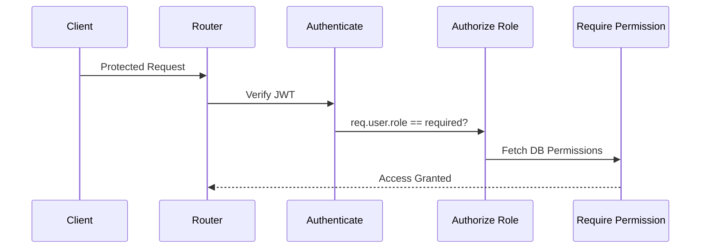

# Authorization & RBAC

## Role-Based Access Control (RBAC)
Authorization in ELIMINATE is granular and database-driven. Every `User` has a `Role`. Every `Role` can be mapped to multiple `Permission`s via `RolePermission`.

## Protected Route Flow

## Middleware Execution
1. **`authenticate`**: Verifies JWT. Injects `req.user`.
2. **`authorize(...roles)`**: Statically checks `req.user.role.name`. Zero database queries.
3. **`requirePermission(...permissions)`**: Queries the database to dynamically verify if the user's role possesses the requested permission string.

## Security Considerations
- Permission names should be highly specific (e.g., `CREATE_WORKER`).
- Always validate `req.user.status === 'ACTIVE'` before allowing permission lookups.
