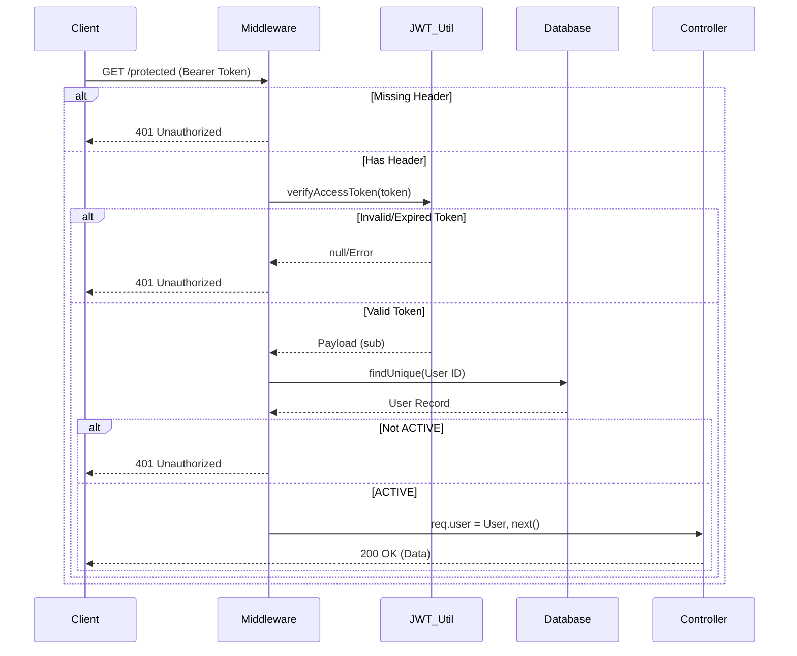

# JWT Implementation

This document details the JSON Web Token (JWT) architecture and implementation used for stateless authentication in the ELIMINATE platform.

## Access Token

Access Tokens are short-lived JWTs used to authenticate and authorize requests to protected API routes. They are signed with a secret key and contain non-sensitive user identity information. Clients must include this token in the `Authorization` header as a `Bearer` token.

## Refresh Token

Refresh Tokens are long-lived tokens used to securely request new Access Tokens without requiring the user to log in again.
- They are issued alongside Access Tokens during login.
- Unlike Access Tokens, Refresh Tokens are **hashed using bcrypt** and stored in the database.
- The raw Refresh Token is sent to the client only once. When presented for renewal, it is verified using `bcrypt.compare` against the stored hash.

## Token Expiration

- **Access Token Expiration**: Configured via `authConfig` (typically 15m to 1h). Once expired, the client must use the Refresh Token.
- **Refresh Token Expiration**: Configured via `authConfig` (typically 7d to 30d). It has an absolute expiration date stored in the database (`refreshTokenExpiresAt`).

## JWT Payload

The standard payload for an Access Token contains:
- `sub`: The subject identifier (User ID).
- `iat`: Issued At timestamp.
- `exp`: Expiration timestamp.

*(Note: Actual payload structure may vary slightly depending on `generateAccessToken` implementation).*

## Signing

Tokens are signed symmetrically using the HMAC SHA-256 algorithm (HS256). The secret keys used for signing must be securely managed via environment variables.

## Verification

Tokens are verified using the `verifyAccessToken` and `verifyRefreshToken` utilities. This ensures the token has a valid signature and has not expired.

## Authentication Middleware

The `authenticate` middleware (`auth.middleware.js`) intercepts protected requests:
1. Extracts the token from the `Authorization: Bearer <token>` header.
2. Verifies the token signature and expiration.
3. Extracts the `sub` (User ID).
4. Queries the database to verify the user exists and their status is `ACTIVE`.
5. Attaches the `user` object to the `req` for downstream controllers.

## Security Considerations

- **Statelessness vs Validation**: While Access Tokens are stateless, the middleware performs a database lookup to ensure the account hasn't been suspended mid-session.
- **Hashed Refresh Tokens**: Storing only hashes of Refresh Tokens prevents attackers from stealing tokens in the event of a database dump.
- **Secure Transport**: JWTs must only be transmitted over HTTPS to prevent interception.

## Mermaid Diagrams

### Token Verification Flow

## Data Tables

### Token Types Comparison

| Feature | Access Token | Refresh Token |
| :--- | :--- | :--- |
| **Lifespan** | Short-lived (e.g., 15m) | Long-lived (e.g., 7d) |
| **Usage** | Every protected API call | Only at `/refresh-token` endpoint |
| **Storage (DB)** | None (Stateless) | Bcrypt Hash + Expiry Date |
| **Revocation** | Difficult (requires blocklist) | Easy (invalidate hash in DB) |
| **Payload** | User ID (`sub`) | User ID (`sub`) or secure random string |
