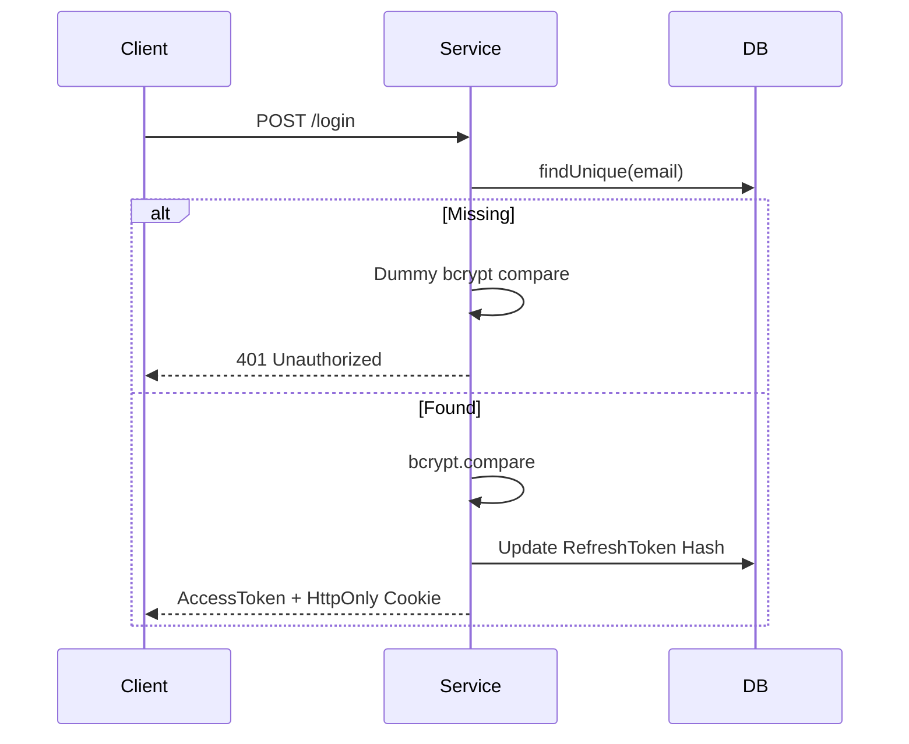

# Login API Flow

## Validation
Zod forces strict schema.

## Database Flow

```mermaid
sequenceDiagram
    Client->>Service: POST /login
    Service->>DB: findUnique(email)
    alt Missing
        Service->>Service: Dummy bcrypt compare
        Service-->>Client: 401 Unauthorized
    else Found
        Service->>Service: bcrypt.compare
        Service->>DB: Update RefreshToken Hash
        Service-->>Client: AccessToken + HttpOnly Cookie
    end
```

## Security Notes
- Timing attacks are neutralized.
- Mass assignment prevented by Zod `.strict()`.
