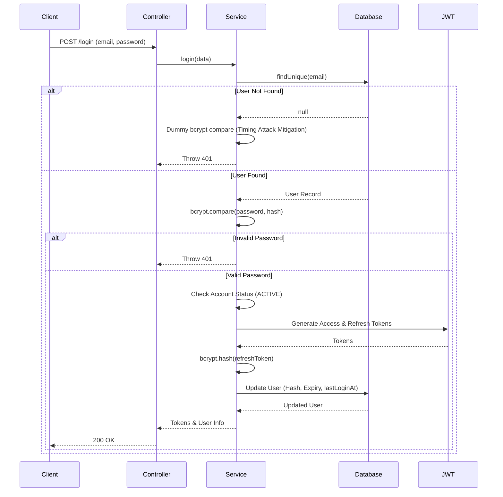

# Login Flow

This document details the authentication and login process implemented in the ELIMINATE platform.

## Overview

The login flow securely authenticates a user based on their email and password, verifies their account status, and issues stateless Access Tokens alongside long-lived Refresh Tokens.

## Validation

Requests are validated using a Zod schema (`loginSchema`):
- **email**: Must be valid, automatically trimmed and lowercased.
- **password**: Must be provided (minimum 1 character).

## Password Verification

The system fetches the user record by email. If the user is found, their stored `passwordHash` is compared against the incoming password using `bcrypt.compare`.

> [!NOTE] 
> To prevent user enumeration via timing attacks, if a user is *not* found, the system performs a dummy `bcrypt.compare` operation using a fake hash before returning a `401 Unauthorized` error.

## JWT Generation

Upon successful password verification, the system issues two tokens:
1. **Access Token**: A short-lived JSON Web Token containing the user's ID and role, used for authorizing API requests. Generated via `generateAccessToken`.
2. **Refresh Token**: A long-lived, cryptographically secure token used to obtain new Access Tokens. Generated via `generateRefreshToken`.

## Refresh Token Generation

The plain refresh token is returned to the user, but for security, only its hash (generated via `bcrypt.hash`) is stored in the database. An expiration date is also calculated based on `authConfig.refreshExpiresIn`.

## Database Update

A `prisma.user.update` operation is performed to:
- Store the `refreshTokenHash`
- Set `refreshTokenExpiresAt`
- Update `lastLoginAt` to the current timestamp
- Reset `failedLoginAttempts` to `0`

## Response

The API responds with the generated tokens and sanitized user data:
- `accessToken`
- `refreshToken`
- `user`: (id, email, status, profileType, role, etc.)

## Error Handling

- **Invalid Credentials**: Returns `401 Unauthorized` for incorrect passwords or non-existent emails.
- **Status Checks**: Returns `403 Forbidden` if the user's status is `PENDING`, `SUSPENDED`, `REJECTED`, or `DELETED`.

## Mermaid Sequence Diagram

## Best Practices

- **Timing Attack Mitigation**: Consistent response times regardless of whether an email exists in the database.
- **Hashed Refresh Tokens**: Refresh tokens are treated like passwords and hashed in the database to mitigate database leak impacts.
- **Status Gating**: Strict enforcement of the `ACTIVE` state prevents disabled users from obtaining tokens.
