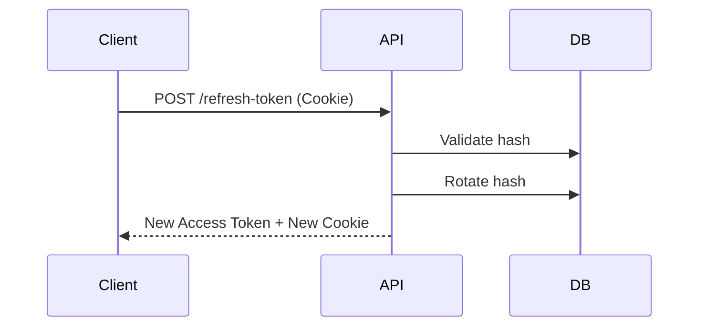

# Refresh Token Implementation

## Refresh Lifecycle

## Security Strategy
- Raw refresh tokens are NEVER stored. They are `bcrypt` or `SHA-256` hashed in the database.
- Transported exclusively via `HttpOnly`, `Secure`, `SameSite=strict` cookies.
- Changing passwords immediately clears all hashes, forcing global logout.
