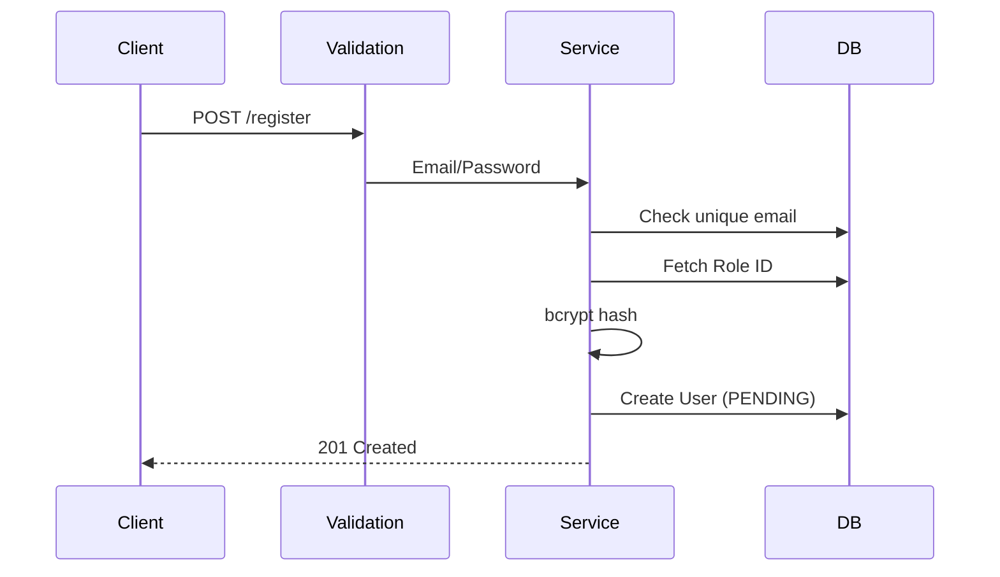

# Register API Flow

## Complete Lifecycle

```mermaid
sequenceDiagram
    Client->>Validation: POST /register
    Validation->>Service: Email/Password
    Service->>DB: Check unique email
    Service->>DB: Fetch Role ID
    Service->>Service: bcrypt hash
    Service->>DB: Create User (PENDING)
    Service-->>Client: 201 Created
```

## Security Considerations
- Prevents role escalation by forcing `accountType` validation.
- Passwords are bcrypt hashed prior to storage.
