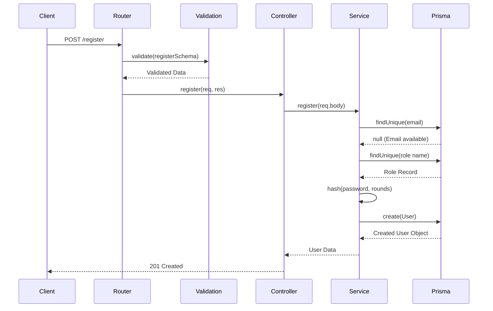

# User Registration Flow

This document details the user registration flow implemented in the ELIMINATE platform.

## Overview

The registration process allows new users to create an account by providing an email, a password, and selecting an account type. The system ensures data integrity, hashes the password, and assigns the correct role before persisting the user to the database.

## Request Flow

## Validation

All incoming requests are validated using Zod before reaching the controller.

- **email**: Must be a valid email format. It is automatically transformed to lowercase and trimmed of whitespace.
- **password**: Must be a string, at least 8 characters long, and a maximum of 100 characters.
- **accountType**: Must strictly be one of `CLIENT`, `AGENCY`, or `WORKER`.

## Password Hashing

The system uses `bcrypt` to hash user passwords.
- The raw password is never stored in plain text.
- The `bcrypt.hash` function is called with a predefined number of salt rounds configured in `authConfig.bcryptRounds`.
- This ensures computational resistance against brute-force and dictionary attacks.

## Database Operations

The `auth.service.js` performs the following Prisma operations:
1. **Email Check**: `prisma.user.findUnique` to ensure the email doesn't already exist. Throws a `409 Conflict` if found.
2. **Role Fetch**: `prisma.role.findUnique` to find the role ID matching the provided `accountType`. Throws a `400 Bad Request` if invalid.
3. **User Creation**: `prisma.user.create` to insert the new user record, linking the hashed password, email, `profileType`, and `roleId`.

## Response Structure

On successful registration, the API responds with a `201 Created` status and the sanitized user object:
- `id`
- `email`
- `profileType`
- `status`
- `createdAt`

(Note: Sensitive fields like `passwordHash` are omitted from the selection).

## Error Handling

- **Validation Errors**: Zod schema failures return a `400 Bad Request` with detailed field errors.
- **Duplicate Email**: Returns `409 Conflict` with the message "Email already exists".
- **Invalid Role**: Returns `400 Bad Request` with the message "Invalid account type".

## Security Considerations

- **Data Sanitization**: Emails are cast to lowercase to prevent duplicate registrations with varying casing.
- **Password Strength**: Minimum length requirements enforced at the gateway.
- **Secure Storage**: Only salted bcrypt hashes are persisted.
- **Over-posting**: The controller explicitly maps only `email`, `password`, and `accountType` through the validator, ignoring arbitrary fields.

## Best Practices

- Separation of concerns is maintained: Router -> Validation Middleware -> Controller -> Service -> DB.
- Fast failure: Validation and existence checks happen before expensive hashing operations.
