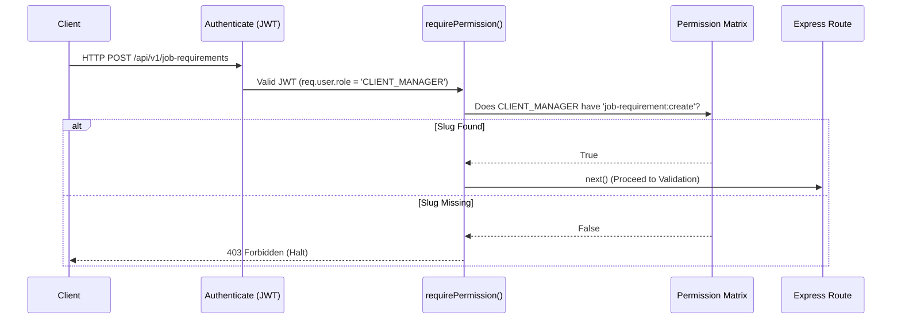

# Permission System Overview

The ELIMINATE backend enforces access control using a strict string-based **Permission Slug** system. 

Unlike traditional Role-Based Access Control (RBAC) where route access is granted directly to a generic role (e.g., `if (user.role === 'ADMIN')`), our system abstracts roles completely out of the router. Express routes are bound exclusively to **Permissions**, and Roles act solely as logical containers mapping to these permission slugs.

This architecture allows us to radically alter what an `AGENCY_MANAGER` or `CLIENT_MANAGER` can access without ever touching the Express route configurations.

# Permission Naming Convention

Permissions in ELIMINATE follow an uncompromising, standardized format:

> `<module-name>:<action>`

- **Module Name**: The singular, kebab-case domain identifier matching the folder structure (e.g., `job-requirement`, `worker-skill`).
- **Action**: The explicitly authorized CRUD operation (`create`, `read`, `update`, `delete`).

# Permission Groups

## Authentication & Users
| Permission | Module | Purpose |
|------------|--------|---------|
| `users:read` | Users | View core identity profiles. |
| `users:update` | Users | Modify core identity strings (e.g. email verifications). |
| `users:delete` | Users | Soft-delete an identity. |

## Core Profiles
| Permission | Module | Purpose |
|------------|--------|---------|
| `worker:create` | Worker | Register a B2C laborer profile. |
| `worker:read` | Worker | View laborer profiles and statuses. |
| `worker:update` | Worker | Modify laborer demographics. |
| `worker:delete` | Worker | Soft-delete a worker profile. |
| `client:create` | Client | Register a B2B job creator. |
| `client:read` | Client | View B2B client details. |
| `client:update` | Client | Modify client contact information. |
| `client:delete` | Client | Soft-delete a client entity. |
| `agency:create` | Agency | Register a B2B labor supplier. |
| `agency:read` | Agency | View agency licensing and contact details. |
| `agency:update` | Agency | Modify agency records. |
| `agency:delete` | Agency | Soft-delete an agency entity. |

## Global Taxonomies
| Permission | Module | Purpose |
|------------|--------|---------|
| `skill:create` / `read` / `update` / `delete` | Skill | Manage the global abilities dictionary. |
| `category:create` / `read` / `update` / `delete`| Category | Manage global job sectors. |
| `language:create` / `read` / `update` / `delete`| Language | Manage global spoken dialects. |
| `location:create` / `read` / `update` / `delete`| Location | Manage geographical districts. |

## Mappings (Many-to-Many)
| Permission | Module | Purpose |
|------------|--------|---------|
| `worker-skill:*` | WorkerSkill | Manage the specific abilities mapped to a laborer. |
| `worker-language:*`| WorkerLanguage | Manage the spoken dialects mapped to a laborer. |
| `agency-worker:*` | AgencyWorker | Manage the operational binding of a worker to a supplier. |

## Operational Documents
| Permission | Module | Purpose |
|------------|--------|---------|
| `job-requirement:create` | JobRequirement | Generate a new labor order. |
| `job-requirement:read` | JobRequirement | View labor orders and budgets. |
| `job-requirement:update` | JobRequirement | Alter requirement priorities or statuses. |
| `job-requirement:delete` | JobRequirement | Cancel/Soft-delete a requirement. |

---

# Route Protection & Middleware Lifecycle

## `requirePermission` Middleware
The gatekeeper of the application. It acts as an HTTP interceptor placed immediately after the `authenticate` middleware in the route definition.

```javascript
router.post(
  "/",
  requirePermission("job-requirement:create"),
  validate(schema),
  controller
);
```

## Permission Lookup Flow
1. **Authentication**: The JWT is verified. `req.user` is populated (which includes `req.user.role`).
2. **Interception**: `requirePermission` pauses execution.
3. **Lookup**: The middleware extracts the user's role and cross-references the internal Permission Matrix (`src/middleware/authorize.middleware.js`).
4. **Evaluation**: It checks if the required slug (e.g., `job-requirement:create`) exists inside the role's assigned array.
5. **Resolution**: If valid, `next()` is called. If invalid, the request is permanently halted with a `403 Forbidden` JSON response.

# Authorization Lifecycle Diagram



# Best Practices for Creating New Permissions

1. **Strict Kebab-Case**: Always align the permission prefix with the exact folder name of the module. If you create a `bookings` module, the permission must be `booking:create`.
2. **Use Standard Action Verbs**: Stick to `create`, `read`, `update`, `delete`.
3. **Handle Edge Actions Explicitly**: If a route performs a non-standard action that shouldn't be bundled under `update` (e.g., triggering a background payout), create an explicit slug like `invoice:pay`. Do not overload `invoice:update`.
4. **Never Hardcode Roles**: Never write an Express route using `requireRole('ADMIN')`. Roles must remain fluid; permissions must remain absolute.
5. **Assign Strategically**: When registering a new slug in the Matrix, do not assign it to `ADMIN` implicitly. Manually verify exactly which operational roles demand access to the endpoint.
