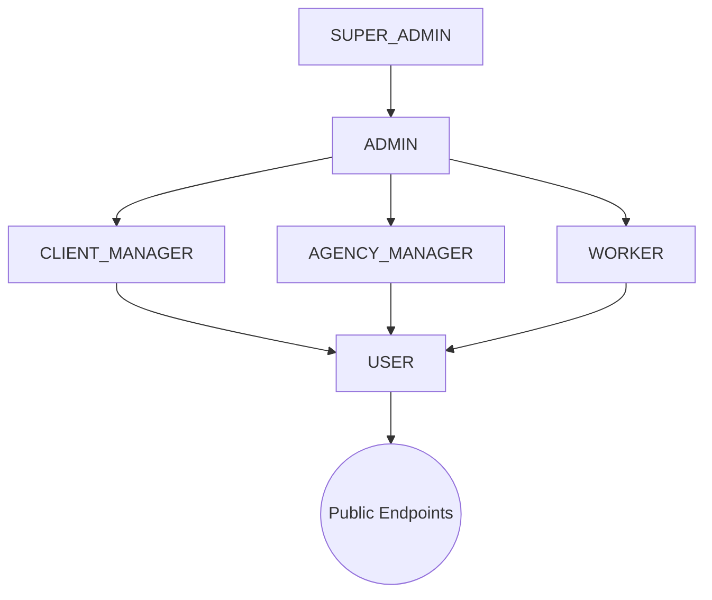

# RBAC Overview

The ELIMINATE backend strictly enforces **Role-Based Access Control (RBAC)** to mathematically guarantee logical isolation between our B2B (Agencies, Clients) and B2C (Workers) domains. 

At the core of the system, a user's `role` dictates their absolute maximum boundary of operation. Rather than hardcoding user IDs or hierarchical integers (e.g. `role: 1`), ELIMINATE relies on explicit String Enums at the database level. These Enums map dynamically to permission matrices inside our `requirePermission` authorization middleware, ensuring access is strictly verified on every single inbound HTTP request before the Controller layer is reached.

# Role Philosophy

We adhere to the **Principle of Least Privilege**. Users are provisioned with the absolute minimum access required to execute their specific domain tasks. 

By utilizing distinct roles for `CLIENT_MANAGER` and `AGENCY_MANAGER`, we eliminate the risk of horizontal privilege escalation. A Client can never access an Agency's internal workforce roster, and an Agency can never modify a Client's Job Requirement parameters, because their roles physically prevent the Express router from mapping their request.

# Role Hierarchy

*(Note: Hierarchy implies operational oversight, not strict permission inheritance. A Super Admin can govern Admins, but all roles map explicitly to permission slugs).*

# Role Definitions

## SUPER_ADMIN
- **Purpose**: Absolute control over the platform's infrastructure and core dictionaries.
- **Responsibilities**: Modifying global taxonomies (`Skill`, `Category`, `Language`, `Location`), performing hard-deletions if legally required, and overseeing system migrations.
- **Typical User**: Principal Software Architect, Database Administrator.
- **Accessible Modules**: All Modules (`*`).

## ADMIN
- **Purpose**: Overseeing operational platform health and resolving B2B disputes.
- **Responsibilities**: Approving new Agencies, overriding blocked Client accounts, and managing widespread support tickets without altering global code dictionaries.
- **Typical User**: Platform Support Staff, Operations Manager.
- **Accessible Modules**: `Client`, `Agency`, `Worker`, `JobRequirement`.

## CLIENT_MANAGER
- **Purpose**: B2B representative acquiring workforce labor.
- **Responsibilities**: Creating, editing, and fulfilling `JobRequirement` documents. Paying invoices and managing their specific `Client` profile.
- **Typical User**: External HR Manager, Corporate Procurement Officer.
- **Accessible Modules**: `Client`, `JobRequirement`, `Location`, `Category` (Read-only).

## AGENCY_MANAGER
- **Purpose**: B2B representative supplying workforce labor.
- **Responsibilities**: Onboarding `Worker` profiles, mapping `AgencyWorker` relationships, declaring worker proficiencies, and responding to open `JobRequirement` bids.
- **Typical User**: External Staffing Agency Owner, Gig Dispatcher.
- **Accessible Modules**: `Agency`, `Worker`, `WorkerSkill`, `WorkerLanguage`, `AgencyWorker`.

## WORKER
- **Purpose**: B2C laborer executing gig contracts.
- **Responsibilities**: Updating personal demographic info, accepting assignments, checking into active sites (future attendance module), and viewing personal skill maps.
- **Typical User**: Field Laborer, Gig Worker, Shift Employee.
- **Accessible Modules**: `Worker` (Self), `WorkerSkill` (Read-only), `WorkerLanguage` (Read-only).

## USER
- **Purpose**: The absolute baseline identity. 
- **Responsibilities**: Viewing public landing pages, managing their foundational authentication profile (changing passwords, requesting password resets).
- **Typical User**: Un-onboarded registration, Suspended account.
- **Accessible Modules**: `Auth`.

---

# Role Matrix

| Role | Description | Access Level | Responsibilities |
|------|-------------|--------------|------------------|
| `SUPER_ADMIN` | Unrestricted platform sovereign. | Tier 0 (Global) | Architecture, Taxonomy mapping. |
| `ADMIN` | Operational oversight. | Tier 1 (Platform) | Account approvals, B2B dispute resolution. |
| `CLIENT_MANAGER`| B2B labor consumer. | Tier 2 (Domain) | Managing Job Requirements and Budgets. |
| `AGENCY_MANAGER`| B2B labor supplier. | Tier 2 (Domain) | Managing Worker rosters and Assignments. |
| `WORKER` | B2C laborer. | Tier 3 (Self) | Managing personal availability. |
| `USER` | Unverified identity baseline. | Tier 4 (None) | Password resets, account setup. |

# Interactions with Permissions

Roles do **not** directly grant access to HTTP routes. 
Instead, Roles grant access to **Permissions** (e.g., `job-requirement:write`).

1. The `requirePermission('job-requirement:write')` middleware intercepts the request.
2. The middleware inspects `req.user.role`.
3. The middleware checks the internal memory matrix: *Does the role `CLIENT_MANAGER` possess the slug `job-requirement:write`?*
4. If yes, the request proceeds to Zod validation. If no, an immediate `403 Forbidden` response is fired.

# Best Practices for Expanding RBAC

When business requirements dictate adding a new role (e.g., `FINANCE_AUDITOR`):

1. **Modify Database Enum**: Add the new role string to `enum Role` in `prisma/schema.prisma` and execute `prisma migrate dev`.
2. **Update Matrix**: Register the role explicitly inside the authorization matrix located at `src/middleware/authorize.middleware.js`.
3. **Be Granular**: Do not copy/paste permissions from `ADMIN`. Explicitly grant only the exact `slugs` required (e.g., `invoice:read`).
4. **Never Hardcode IDs**: Never bypass RBAC by writing `if (user.id === '123')` anywhere in the application. Always rely on the Role Enum.
