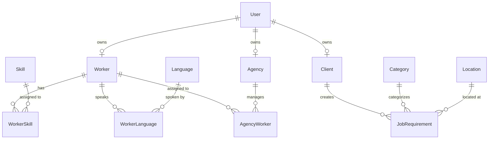

# Database Overview

The ELIMINATE database is built on a foundation of strict referential integrity, absolute normalisation, and scalable relational mapping. 

- **PostgreSQL** was selected for its battle-tested ACID compliance, powerful native indexing strategies, and ability to handle complex `JOIN` operations effortlessly—crucial for our heavily interconnected Many-to-Many mapping tables.
- **Prisma ORM** was chosen to eliminate raw SQL injection vectors, provide absolute Type Safety between the database and our JavaScript runtime, and effortlessly manage schema migrations (`prisma migrate`).

# Database Design Principles

- **Normalization**: The schema strictly adheres to 3NF. Shared attributes (e.g., authentication) are isolated (`User`), while domain specifics are separated (`Worker`, `Client`).
- **UUID Primary Keys**: Every table utilizes `UUID v4` to prevent ID enumeration vulnerabilities and simplify potential future database sharding.
- **Foreign Keys**: Enforced everywhere. No floating relations are permitted. Prisma implicitly constructs foreign keys linking relational mapping tables to their parents.
- **Indexes**: Applied strategically to foreign keys, unique identifiers (`slug`, `code`), and filterable enums (`status`, `priority`) to guarantee sub-millisecond query execution.
- **Soft Delete**: Hard destructive actions (`DELETE FROM`) are forbidden globally on core models. A `deletedAt` flag is leveraged to preserve historical audits.
- **Unique Constraints**: Used extensively for business identifiers (`workerCode`, `email`, `gstNumber`) to push data integrity checks down to the database engine.
- **Composite Keys**: `@@unique([parentId, childId])` composites enforce idempotency in mapping tables (e.g., stopping a Worker from being assigned the same Skill twice).
- **Audit Fields**: Every single table utilizes Prisma's `@default(now())` for `createdAt` and `@updatedAt` for `updatedAt`.

# Entity Relationship Overview

# Model Documentation

## User
### Purpose
The root authentication entity handling cryptographic secrets and global RBAC identification.

### Fields
| Field | Type | Nullable | Default | Description |
|-------|------|----------|---------|-------------|
| `id` | String | No | UUID | Primary Key |
| `email` | String | No | None | Unique login identifier |
| `passwordHash` | String | No | None | bcrypt hashed string |
| `refreshTokenHash`| String | Yes | None | Hashed rotation token |
| `role` | Role | No | USER | RBAC authority tier |
| `profileType` | ProfileType| No | WORKER | Logical association |
| `deletedAt` | DateTime| Yes | None | Soft delete tombstone |

### Relationships
- `Worker` (1:1)
- `Client` (1:1)
- `Agency` (1:1)

### Indexes
- `@@index([email])`
- `@@index([role])`

## Worker
### Purpose
B2C operational profiles for laborers/gig workers, containing demographic and employment data.

### Fields
| Field | Type | Nullable | Default | Description |
|-------|------|----------|---------|-------------|
| `id` | String | No | UUID | Primary Key |
| `userId` | String | No | None | FK to User (Unique) |
| `workerCode` | String | Yes | None | Unique business identifier |
| `firstName` | String | Yes | None | Given name |
| `employmentStatus`| Enum | No | ACTIVE | Operational state |

### Relationships
- `User` (1:1)
- `WorkerSkill` (1:M)
- `WorkerLanguage` (1:M)
- `AgencyWorker` (1:M)

### Indexes
- `@@index([userId])`
- `@@index([workerCode])`

## Client
### Purpose
B2B entities authorized to create Job Requirements.

### Fields
| Field | Type | Nullable | Default | Description |
|-------|------|----------|---------|-------------|
| `id` | String | No | UUID | Primary Key |
| `userId` | String | No | None | FK to User (Unique) |
| `clientCode` | String | Yes | None | Unique business identifier |
| `companyName` | String | Yes | None | Entity name |
| `gstNumber` | String | Yes | None | Tax ID |

### Relationships
- `User` (1:1)
- `JobRequirement` (1:M)

## Agency
### Purpose
B2B entities supplying workers to fulfill requirements.

### Fields
| Field | Type | Nullable | Default | Description |
|-------|------|----------|---------|-------------|
| `id` | String | No | UUID | Primary Key |
| `userId` | String | No | None | FK to User (Unique) |
| `agencyName` | String | Yes | None | Entity name |
| `licenseNumber` | String | Yes | None | Operating license |

### Relationships
- `User` (1:1)
- `AgencyWorker` (1:M)

## Skill / Category / Language / Location
### Purpose
Global dictionaries used for taxonomy and matching.

### Fields (Common across all four)
| Field | Type | Nullable | Default | Description |
|-------|------|----------|---------|-------------|
| `id` | String | No | UUID | Primary Key |
| `name` | String | No | None | Human readable text |
| `slug`/`code`| String | No | None | Unique identifier |
| `isActive` | Boolean| No | True | Hard toggle switch |

### Relationships
- Maps heavily (1:M) to mapping junction tables (e.g., `WorkerSkill`, `JobRequirement`).

## WorkerSkill / WorkerLanguage / AgencyWorker
### Purpose
Many-to-Many junction tables physically bridging associations between core entities.

### Fields (WorkerSkill Example)
| Field | Type | Nullable | Default | Description |
|-------|------|----------|---------|-------------|
| `id` | String | No | UUID | Primary Key |
| `workerId` | String | No | None | FK to Worker |
| `skillId` | String | No | None | FK to Skill |
| `proficiencyLevel`| Enum | No | None | Domain specific enum |

### Constraints
- `@@unique([workerId, skillId])` guarantees absolute mapping deduplication.

## JobRequirement
### Purpose
Complex dynamic operational documents specifying client labor needs.

### Fields
| Field | Type | Nullable | Default | Description |
|-------|------|----------|---------|-------------|
| `id` | String | No | UUID | Primary Key |
| `requirementCode`| String | No | None | Unique tracking string |
| `clientId` | String | No | None | Creator |
| `status` | Enum | No | DRAFT | Operational pipeline state |
| `salaryAmount` | Decimal| Yes | None | Budget allocation |

### Relationships
- `Client` (M:1)
- `Category` (M:1)
- `Location` (M:1)

### Indexes
- `@@index([status])`, `@@index([priority])`, `@@index([clientId])`

# Enum Documentation

- **Role**: `SUPER_ADMIN, ADMIN, CLIENT_MANAGER, AGENCY_MANAGER, WORKER, USER`. Used by `User` for RBAC mapping.
- **ProfileType**: `WORKER, CLIENT, AGENCY, INTERNAL`. Defines logical 1:1 table routing upon registration.
- **EmploymentStatus**: `ACTIVE, INACTIVE, ON_LEAVE, TERMINATED`. Represents `Worker` availability.
- **SkillProficiency**: `BEGINNER, INTERMEDIATE, ADVANCED, EXPERT`. Applied in `WorkerSkill`.
- **LanguageProficiency**: `BASIC, CONVERSATIONAL, PROFESSIONAL, NATIVE`. Applied in `WorkerLanguage`.
- **RequirementStatus**: `DRAFT, OPEN, PARTIALLY_FILLED, FILLED, COMPLETED, CANCELLED`. `JobRequirement` lifecycle state.
- **SalaryType**: `HOURLY, DAILY, MONTHLY, FIXED`. `JobRequirement` compensation structure.
- **Priority**: `LOW, MEDIUM, HIGH, URGENT`. Sorting vector for Requirements.

# Relationship Strategy

- **One-to-One**: E.g., `User` to `Worker`. Configured using the `@unique` constraint on the FK (`userId`). Enforces strict horizontal isolation of Auth logic from Profile logic.
- **One-to-Many**: E.g., `Client` to `JobRequirement`. A Client can create infinite requirements, but a requirement has strictly one author.
- **Many-to-Many**: Handled explicitly using Junction Tables rather than Prisma's implicit implicit arrays. E.g., `AgencyWorker`. This allows us to store vital metadata on the relationship itself (e.g. `assignedAt`, `status`, `notes`).

# Soft Delete Strategy

We globally enforce soft deletion via the `deletedAt DateTime?` column on core models.

- **Benefits**: Eradicates the risk of catastrophic cascading hard deletions. Preserves deep analytics and invoice historical references.
- **Query Filtering**: Every `findMany` and `findUnique` execution mathematically enforces `{ where: { deletedAt: null } }` to filter out tombstones.
- **Data Recovery**: Allows immediate restoration by simply issuing `PATCH { deletedAt: null }` without utilizing expensive database backup rolls.

# Naming Conventions

- **Model names**: `PascalCase` and strictly singular (e.g., `Worker`, `JobRequirement`).
- **Field names**: `camelCase` (e.g., `firstName`, `salaryAmount`).
- **Enum names**: `PascalCase` for the definition, `UPPER_SNAKE_CASE` for the values (e.g., `RequirementStatus.PARTIALLY_FILLED`).
- **Relation names**: Pluralized array maps (e.g., `jobRequirements`), singular foreign keys (e.g., `client`).

# Performance Strategy

- **Indexes**: Heavily applied to foreign keys (to optimize join scans) and filter-heavy strings (e.g., `email`, `workerCode`).
- **Foreign Keys**: Configured explicitly to construct high-speed indexing paths within PostgreSQL.
- **Pagination**: Large tables (`Worker`, `JobRequirement`) rely on `skip` and `take` via cursor/offset methodology.
- **Search Readiness**: Filterable strings utilize insensitive regex matching logic securely abstracted via Prisma's `contains: "str", mode: "insensitive"`.

# Future Database Expansion

The Modular Monolith schema is engineered precisely for incoming operational expansion:
- **Booking / Assignment**: Will act as junction tables between `JobRequirement` and `Worker`/`Agency`, retaining their own operational states (`BookingStatus`).
- **Attendance**: Will map linearly (`1:M`) off `Assignment` records containing `clockIn`/`clockOut` DateTime objects.
- **Payment / Invoice**: Will securely map to `Client` and `Agency` IDs, referencing the frozen budget numbers stored in finalized `JobRequirement` rows to enforce financial immutability.

# Best Practices

- **Explicit M2M**: Never use Prisma's implicit implicit many-to-many tables. Always declare the junction table manually to retain control over composite indexing and cascade rules.
- **Cascade Wisely**: `onDelete: Cascade` is applied to internal 1:1 maps (like `User->Worker`), but avoided between critical business ties (e.g., deleting an Agency should not cascade delete the Worker).
- **Enums Over Strings**: Never use arbitrary `VARCHAR` values for stateful strings. Always lock them using PostgreSQL native enums via Prisma schema to prevent invalid mutations.
