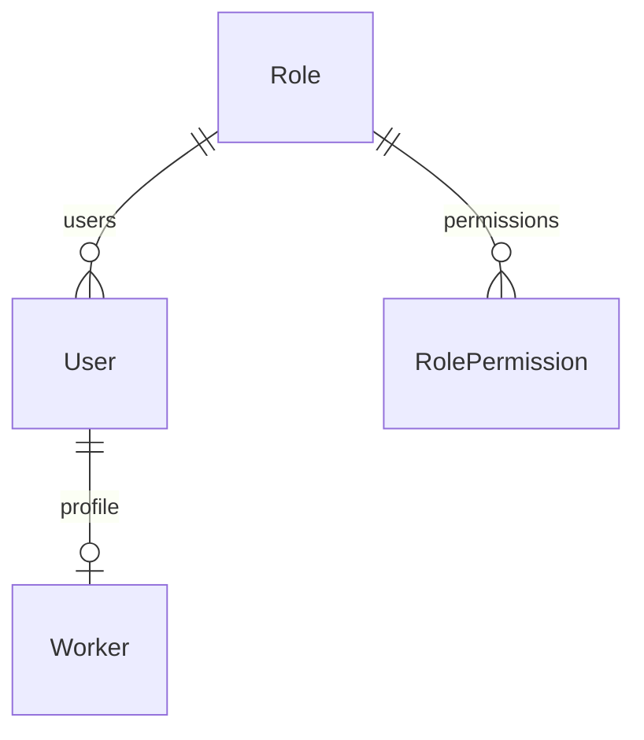

# ELIMINATE: Prisma Schema

## Entity Relationship Diagram

## Primary Keys
Every model uses `String @id @default(uuid())`. Integer IDs are banned.

## Foreign Keys
Strictly mapped. 1:1 relations (e.g. User -> Worker) use `@unique` on the foreign key.

## Soft Delete
Records are never deleted. A `deletedAt DateTime?` field is populated.

## Timestamps
Every table contains `createdAt` and `updatedAt`.
