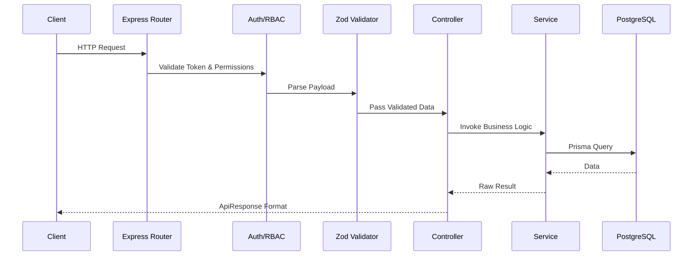

# Job Requirement Execution Flow

## Sequence Diagram

## Request Lifecycle
Every request passes through a strict gauntlet of interceptors before reaching business logic, ensuring absolute type safety.

## Controller Flow
The Controller acts purely as a transport layer. It unwraps Express parameters (`req.validatedData`, `req.params`) and routes them to the Service, wrapping the final result in `ApiResponse`.

## Service Flow
The Service layer handles the orchestration:
1. Validate existential dependencies (e.g., Parent records exist).
2. Execute business-specific duplicate checks.
3. Bundle logic into Prisma `$transaction` where multi-row mutations occur.

## Database Flow
Queries are constructed using the Prisma Singleton. All `findMany` operations employ `deletedAt: null` filters implicitly to respect soft-deletions.

## Error Flow
If any step fails, an `AppError` is thrown. This is caught by `asyncHandler` and bubbled up to the global Error Handling Middleware which strips sensitive stack traces in production before returning JSON.
