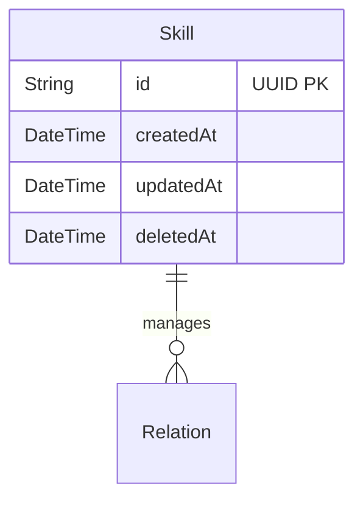

# Skill Database Model

## Prisma Model

## Fields
- **id**: UUID v4, primary key.
- **createdAt**: Automatically tracked insertion time.
- **updatedAt**: Automatically tracked mutation time.
- **deletedAt**: Nullable timestamp used for soft deletions.

## Relations
- Uses `onDelete: Cascade` for child maps to ensure referential safety.
- Utilizes Prisma's generated relation arrays.

## Indexes
- `@@index([deletedAt])` for optimized soft-delete exclusion queries.
- Target fields indexed based on frequent `WHERE` and `ORDER BY` clauses.

## Constraints
- `@unique` constraints applied on business identifiers (e.g., codes, emails, slugs).
- Composite unique constraints `@@unique([parentId, childId])` for mapping tables.

## Enums
- Specific enums used where states are statically defined (e.g., Status, Proficiency, Priority).

## Design Decisions
- Adopted the Prisma Singleton pattern to prevent connection exhaustion.
- Enforced soft deletion to preserve analytical and historical data integrity.
